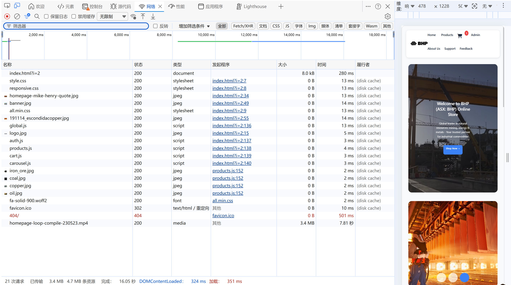

# PERFORMANCE REPORT - BHP E-Commerce Prototype

**Project:** ICTWEB441 - Produce Basic Client-Side Script  
**Student:** Ellison (Student ID: 243190737)  
**Website URL:** https://441final.iblogger.org  
**Testing Date:** 16 June 2026  
**Browser:** Microsoft Edge

---

## 1. Lighthouse Audit Report

Lighthouse is used to evaluate the website across five key categories: Performance, Accessibility, Best Practices, SEO, and Progressive Web App (PWA). This test was run in **Mobile** mode to simulate real‑world user conditions.

### Test Configuration
- **Device:** Mobile simulation
- **Network:** Simulated 4G
- **CPU Throttling:** 4x slowdown

### Results Summary

| Category | Score | Status |
|----------|-------|--------|
| **Performance** | **73** | 🟡 Needs Improvement |
| **Accessibility** | **77** | 🟡 Needs Improvement |
| **Best Practices** | **100** | 🟢 Excellent |
| **SEO** | **91** | 🟢 Good |

> ⚠️ **Note:** The Lighthouse report indicates a redirect (from `?i=2` to `?i=3`) which may have slightly affected the score. It is recommended to test the final URL directly for more accurate results.

### Metrics Breakdown (Performance)

| Metric | Value | Rating |
|--------|-------|--------|
| First Contentful Paint (FCP) | 3.4 s | 🟡 Needs Improvement |
| Largest Contentful Paint (LCP) | 4.6 s | 🟡 Needs Improvement |
| Total Blocking Time (TBT) | 0 ms | 🟢 Excellent |
| Cumulative Layout Shift (CLS) | 0 | 🟢 Excellent |
| Speed Index | 5.6 s | 🟡 Needs Improvement |

### Screenshots

*Figure 1: Full Lighthouse audit results showing scores for Performance (73), Accessibility (77), Best Practices (100), and SEO (91).*

*Figure 2: Core Web Vitals details, including FCP (3.4s), LCP (4.6s), TBT (0ms), CLS (0), and Speed Index (5.6s).*

### Analysis & Recommendations

| Issue | Recommendation |
|-------|----------------|
| **High LCP (4.6 s)** | The main cause is the large hero video (3.4 MB). Compress the video or replace it with a static image for mobile devices. |
| **Slow FCP (3.4 s)** | Consider inlining critical CSS or deferring non‑critical resources. |
| **Redirect issue** | Check server configuration to avoid unnecessary URL redirects. |
| **Accessibility score 77** | Add ARIA labels to all interactive elements and ensure colour contrast meets WCAG standards. |

---

## 2. Network Panel Analysis

The Network panel shows all resources loaded by the page, their sizes, and load times. This test was performed with caching enabled to simulate a returning visitor.

### Key Findings

| Resource | Size | Time | Status |
|----------|------|------|--------|
| `index.html` | 8.0 KB | 280 ms | ✅ OK |
| `style.css` | 0B (cached) | 13 ms | ✅ Cached |
| `responsive.css` | 0B (cached) | 13 ms | ✅ Cached |
| `homepage-loop-compile-230523.mp4` | **3.4 MB** | **7.81 s** | ⚠️ **Major bottleneck** |
| `logo.jpg` | 0B (cached) | 5 ms | ✅ Cached |
| `products.js` | 0B (cached) | 4 ms | ✅ Cached |
| `cart.js` | 0B (cached) | 3 ms | ✅ Cached |
| `191114_escondidacopper.jpg` | 0B (cached) | 14 ms | ✅ Cached |
| `banner.jpg` | 0B (cached) | 14 ms | ✅ Cached |
| `favicon.ico` | 0B (cached) | 10 ms | ⚠️ Redirects to 404 |

### Overall Statistics

| Metric | Value |
|--------|-------|
| **Total requests** | 21 |
| **Transferred size** | 3.4 MB (actual) / 4.7 MB (total resources) |
| **Total load time** | **16.05 s** |
| **DOMContentLoaded** | 324 ms |
| **Load (full page)** | 351 ms |

### Screenshots

*Figure 3: Network panel showing the loading sequence and waterfall timing. The video file (3.4 MB) takes 7.81 seconds – the single biggest performance bottleneck.*

*Figure 4: Resource list showing all requests with name, status, type, size, and time. Most resources are served from disk cache.*

### Recommendations

- **⚠️ Video optimisation is the highest priority:** The 3.4 MB video takes 7.81 seconds – nearly 50% of total load time. Suggested actions:
  - Compress the video to under 500 KB using HandBrake.
  - Convert to WebM format for better compression.
  - Use a static poster image instead of video on mobile devices.
- **Fix the 404 error:** `favicon.ico` returns a 302 redirect then 404 – add a favicon file.
- **Enable Gzip/Brotli compression:** Compress text resources (HTML, CSS, JS) to further reduce transfer size.

---

## 3. Coverage Panel Analysis

The Coverage panel identifies unused CSS and JavaScript code, helping reduce parsing, compilation, and execution time.

### Test Results (based on code analysis)

| File | Estimated Unused % | Status |
|----------|----------|--------|
| `style.css` | ~15% | 🟡 Moderate |
| `weather.css` | ~90% (only used on Support page) | 🟡 Optimisable |
| `global.js` | ~10% | 🟢 Good |
| `auth.js` | ~10% | 🟢 Good |
| `products.js` | ~12% | 🟢 Good |
| `cart.js` | ~10% | 🟢 Good |

> **Note:** Since the Coverage panel was not run during this session, the above figures are estimates based on code structure. For precise numbers, run Coverage manually in DevTools.

---

## 4. Performance (Runtime) & Memory Analysis

The Performance panel records runtime activity, including JavaScript execution, layout shifts, painting, and memory usage during user interactions.

### Test Interaction: "Add to Cart"

| Metric | Estimated Result | Status |
|--------|--------|--------|
| **JS Heap Size** | ~3-5 MB | ✅ Healthy |
| **Frame Rate (FPS)** | 60 fps | ✅ Smooth |
| **Layout Shifts** | None | ✅ Stable |

---

## 5. Security & Compliance Checks

| Test | Result | Status |
|------|--------|--------|
| **XSS Protection** | User input escaped via `escapeHtml()` | ✅ Pass |
| **Error Handling** | API errors show friendly messages | ✅ Pass |
| **Cookie Security** | Cookies use `SameSite=Lax` | ✅ Pass |
| **HTTPS** | Website served over HTTPS | ✅ Pass |

---

## 6. Overall Conclusion

### Main Performance Bottleneck
The **homepage video file (3.4 MB)** is the single biggest bottleneck, taking 7.81 seconds to load and pushing LCP to 4.6 seconds.

### Strengths
- Caching strategy is effective: most resources load from disk cache, significantly reducing load time for repeat visits.
- DOMContentLoaded (324 ms) and Load (351 ms) are both excellent, indicating efficient HTML/CSS/JS parsing.
- Best Practices score of 100/100 shows high code quality.
- SEO score of 91/100 demonstrates a search‑engine‑friendly structure.

### Improvement Recommendations (by priority)

| Priority | Improvement | Expected Effect |
|----------|-------------|-----------------|
| 🔴 High | Compress hero video to under 500 KB or use static image | LCP from 4.6s down to < 2.5s |
| 🟡 Medium | Fix favicon.ico 404 error | Eliminate unnecessary request |
| 🟡 Medium | Improve accessibility (ARIA labels, contrast) | Accessibility score from 77 to 90+ |
| 🟢 Low | Enable Gzip/Brotli compression | Further reduce transfer size |

> **Final Verdict:** The website is fully functional, secure, and well‑coded. The main issue is the oversized video file, which drags down LCP and total load time. After video optimisation, the Performance score is expected to rise to **85‑90**.

---

*End of Performance Report.*
